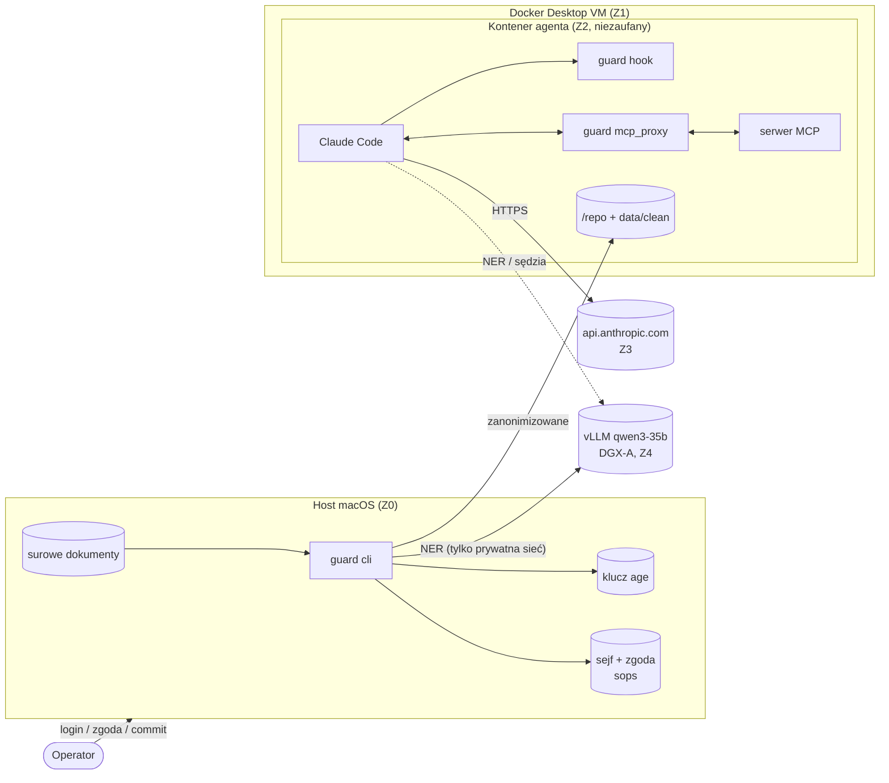
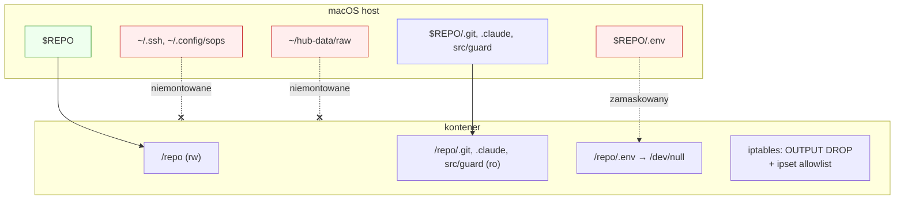
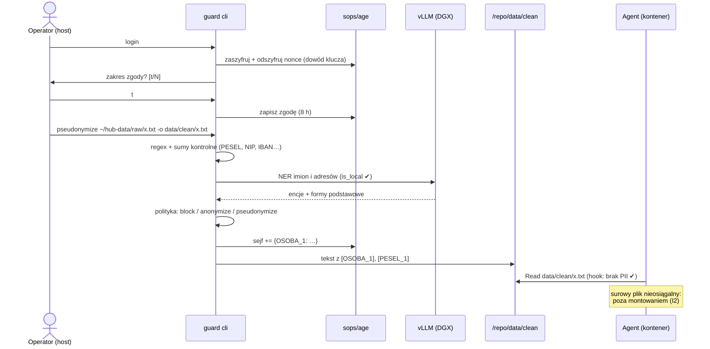
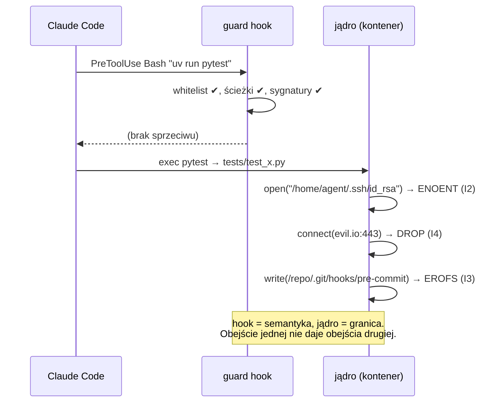

# ADR-0001: Izolacja agenta — kontener jako granica jądra, guard jako warstwa semantyczna

|          |                                                                                          |
| -------- | ---------------------------------------------------------------------------------------- |
| Status   | **Zaakceptowany, zaimplementowany** (`src/guard/sandbox/`; `run.sh selftest`: 23/23 testów ataku + pełna suita w kontenerze) |
| Data     | 2026-10-03                                                                               |
| Zakres   | AI Control Layer (`src/guard/`): agent kodujący (Claude Code) + MCP + lokalny LLM        |
| Decydent | Artur Niklewicz                                                                          |

## 1. Kontekst

AI Control Layer ma zapewnić, że agent:

1. nie wychodzi poza repozytorium (pliki, procesy, sieć);
2. nie widzi surowych danych osobowych; pracuje wyłącznie na danych zanonimizowanych lub spseudonimizowanych za zgodą uwierzytelnionego człowieka;
3. nie wykonuje nieodwracalnych akcji bez potwierdzenia;
4. nie może zmienić własnych reguł ani zatrzeć śladów.

Stan obecny: guard działa jako **hook Claude Code** (`PreToolUse`, `UserPromptSubmit`) i **proxy MCP**. Ograniczenia egzekwuje przez analizę _tekstu_ akcji: parsuje komendy, rozwiązuje ścieżki i symlinki, śledzi `cd`, blokuje `$`, heredoc i subshelle.

**Problem.** Parser widzi tylko komendę, nie jej skutki. Dozwolone `uv run pytest` wykona dowolny kod, który agent wcześniej zapisał w `tests/`, na przykład czytanie `~/.ssh` i wysyłkę przez sieć. Żadna whitelista tekstowa tego nie wykryje. Granicę musi egzekwować jądro systemu.

## 2. Czynniki decyzyjne

| ID  | Czynnik                                                                                                 | Waga      |
| --- | ------------------------------------------------------------------------------------------------------- | --------- |
| D1  | Granica plików, procesów i sieci egzekwowana przez jądro, niezależnie od sposobu wywołania              | krytyczna |
| D2  | Pokrycie **wszystkich** ścieżek wykonania: Bash, Read/Edit/Write, MCP, hooki, kod uruchomiony pośrednio | krytyczna |
| D3  | Sekrety (klucz age, `.env`, `~/.ssh`) fizycznie nieobecne w środowisku agenta                           | krytyczna |
| D4  | Kompatybilność z use case: `uv`/`pytest`, lokalny vLLM (DGX, tailnet), API modelu, MCP                  | wysoka    |
| D5  | Minimalna złożoność: jeden artefakt, uruchamiany jedną komendą, bez orkiestracji                        | wysoka    |
| D6  | Zmiana bez dotykania plików wspólnych monorepo (root należy do innych zespołów)                         | wysoka    |

## 3. Rozważone opcje

| Opcja                                                                  | D1   | D2                         | D3                                              | D4  | D5  | Werdykt                                                  |
| ---------------------------------------------------------------------- | ---- | -------------------------- | ----------------------------------------------- | --- | --- | -------------------------------------------------------- |
| **A.** Tylko hook (stan obecny)                                        | ❌   | ❌                         | ❌                                              | ✅  | ✅  | niewystarczające: omijalne przez kod pośredni            |
| **B.** Wbudowany sandbox Claude Code na hoście (Seatbelt / bubblewrap) | ✅   | ⚠️ tylko Bash i podprocesy | ⚠️ `denyRead` na hoście, sekrety nadal na dysku | ✅  | ✅  | dobre jako minimum, ale Read/Edit/MCP/hooki poza granicą |
| **C.** Kontener (Docker), cały agent w środku                          | ✅   | ✅                         | ✅ (nie montujemy)                              | ✅  | ✅  | **wybrane**                                              |
| **D.** MicroVM (Firecracker / gVisor)                                  | ✅✅ | ✅                         | ✅                                              | ⚠️  | ❌  | overengineering na tym etapie; ścieżka rozwoju           |

Uwaga do C: Docker Desktop na macOS uruchamia kontenery w maszynie wirtualnej Linuksa, więc dostajemy drugą granicę (VM) bez dodatkowej pracy.

## 4. Decyzja

Agent (Claude Code + serwery MCP + guard) działa w **jednym kontenerze** z czterema niezmiennikami egzekwowanymi przez jądro:

| #   | Niezmiennik                                                            | Mechanizm                                                                                                 |
| --- | ---------------------------------------------------------------------- | --------------------------------------------------------------------------------------------------------- |
| I1  | Widoczne jest tylko repo                                               | bind mount `/repo`; brak innych montowań, brak `docker.sock`                                              |
| I2  | Sekrety i surowe dane fizycznie nieobecne                              | klucz age, `~/.ssh`, `~/.aws` niemontowane; `/dev/null` nadpisuje `/repo/.env`; `data/raw` leży poza repo |
| I3  | Agent nie zmienia swoich reguł ani kodu wykonywanego później na hoście | `.git/`, `.claude/`, `src/guard/` montowane `:ro`                                                         |
| I4  | Sieć domyślnie zablokowana                                             | iptables `OUTPUT DROP` + ipset z whitelistą; DNS rozwiązywany raz przy starcie, potem port 53 zablokowany |

Hook i proxy MCP **zostają** jako warstwa semantyczna (PII, zgoda, role, injection, „ask” dla akcji nieodwracalnych, audyt). Kontroli, które odtwarzały granicę parserem, nie usuwamy: zostają jako defense-in-depth.

Operacje uprzywilejowane zostają **na hoście, u człowieka**: `guard login`, `pseudonymize`/`anonymize`, `restore`, `git commit`/`push`.

## 5. Architektura

### 5.1 Model warstw

```
warstwa 0  VM Docker Desktop      granica: hiperwizor        (izolacja od macOS)
warstwa 1  kontener               granica: jądro Linux       (pliki, procesy, sieć, zasoby)
warstwa 2  guard hook             granica: decyzja semantyczna per akcja agenta
warstwa 3  guard mcp_proxy        granica: decyzja semantyczna per wywołanie / wynik MCP
warstwa 4  guard cli (host)       granica: człowiek + klucz age (zgoda, sejf)
```

### 5.2 Katalog elementów

| ID  | Element                                 | Typ           | Strefa           | Opis                                                              |
| --- | --------------------------------------- | ------------- | ---------------- | ----------------------------------------------------------------- |
| E1  | Człowiek (operator)                     | osoba         | Z0 host          | uwierzytelnia się kluczem age, wyraża zgodę, commituje            |
| E2  | `guard cli`                             | proces        | Z0 host          | `login`, `scan`, `anonymize`, `pseudonymize`, `restore`, `report` |
| E3  | Klucz age `~/.config/sops/age/keys.txt` | sekret        | Z0 host          | jedyny klucz do sejfu i zgody                                     |
| E4  | Sejf `.guard/vault.sops.json`           | dane (szyfr.) | Z0 host          | token ↔ oryginał (sops+age)                                       |
| E5  | Zgoda `.guard/consent.sops.json`        | dane (szyfr.) | Z0 host          | user, zakres, ważność 8 h                                         |
| E6  | Surowe dokumenty `~/hub-data/raw`       | dane (PII)    | Z0 host          | nigdy nie montowane do kontenera                                  |
| E7  | Repo `/repo` (w tym `data/clean`)       | dane          | Z2 kontener (rw) | jedyne miejsce zapisu agenta                                      |
| E8  | `.git/`, `.claude/`, `src/guard/`       | konfiguracja  | Z2 kontener (ro) | polityka, hooki, kod guarda                                       |
| E9  | Claude Code                             | proces        | Z2 kontener      | agent; user `agent` (uid hosta), bez capabilities                 |
| E10 | `guard hook`                            | proces        | Z2 kontener      | `PreToolUse` / `UserPromptSubmit`, fail-closed                    |
| E11 | `guard mcp_proxy`                       | proces        | Z2 kontener      | stdio między Claude Code a serwerem MCP                           |
| E12 | Serwer MCP (np. serena)                 | proces        | Z2 kontener      | wgrany do obrazu; bez dostępu do sieci                            |
| E13 | `policy.toml` + `signatures.json`       | konfiguracja  | Z2 (ro)          | centralna polityka + feed sygnatur                                |
| E14 | `audit.jsonl`                           | dane          | Z2 kontener (rw) | decyzje, reguły, liczniki; bez wartości PII                       |
| E15 | Firewall (iptables + ipset)             | mechanizm     | Z2 jądro         | ustawiany przez entrypoint jako root, potem drop                  |
| E16 | API modelu `api.anthropic.com:443`      | usługa zewn.  | Z3 internet      | jedyny dozwolony host publiczny                                   |
| E17 | vLLM `qwen3-35b` `100.117.237.101:8006` | usługa        | Z4 tailnet       | NER dla PII + przyszły sędzia LLM                                 |

### 5.3 Strefy zaufania

| Strefa               | Zawartość   | Zaufanie                                                 | Granica wejścia                          |
| -------------------- | ----------- | -------------------------------------------------------- | ---------------------------------------- |
| Z0 host macOS        | E1–E6       | pełne                                                    | —                                        |
| Z1 VM Docker Desktop | jądro Linux | infrastruktura                                           | hiperwizor                               |
| Z2 kontener          | E7–E15      | **niezaufane** (agent może być przejęty przez injection) | namespaces + mounts + iptables           |
| Z3 internet          | E16         | zewnętrzne                                               | TLS; whitelist IP                        |
| Z4 tailnet           | E17         | własne                                                   | WireGuard (tailscale); whitelist IP:port |

### 5.4 Krawędzie (przepływy)

| ID  | Z → Do         | Protokół / port     | Dane                    | Kontrola                                                           |
| --- | -------------- | ------------------- | ----------------------- | ------------------------------------------------------------------ |
| F1  | E1 → E2        | TTY                 | „tak”, uwierzytelnienie | wymagany TTY; dowód klucza age (szyfrowanie i odszyfrowanie nonce) |
| F2  | E2 → E3        | plik                | klucz prywatny          | tylko host                                                         |
| F3  | E2 → E17       | HTTP/8006 (tailnet) | treść dokumentu         | `is_local()`: odmowa dla hostów publicznych; fail-closed           |
| F4  | E6 → E2 → E7   | plik                | surowy → `data/clean`   | zgoda (E5) wymagana; per-kind block / anonymize / pseudonymize     |
| F5  | E2 → E4/E5     | plik                | sejf, zgoda             | sops `--config /dev/null`, MAC (wykrycie manipulacji)              |
| F6  | E9 → E10       | stdin/stdout JSON   | akcja agenta            | allow (brak outputu) / ask / deny; błąd = deny                     |
| F7  | E9 ↔ E11 ↔ E12 | stdio JSON-RPC      | wywołania i wyniki MCP  | allowlista, ścieżki, PII w argumentach, injection/PII w wynikach   |
| F8  | E9 → E16       | HTTPS/443           | prompt + kontekst       | firewall I4; treść wcześniej filtrowana przez E10                  |
| F9  | E10/E11 → E14  | plik (append)       | zdarzenia audytu        | bez wartości PII                                                   |
| F10 | E9 → E7        | syscalls            | zapis plików            | jądro: rw tylko `/repo`; `:ro` dla E8                              |
| F11 | Z2 → \*        | dowolny             | —                       | **DROP** (domyślnie)                                               |
| F12 | E1 → E7        | git (host)          | commit / push           | tylko człowiek na hoście; `.git` w kontenerze `:ro`                |

### 5.5 Konfiguracja uruchomienia (specyfikacja dla implementacji)

```
obraz:   python:3.13-slim + uv + git + ripgrep + Claude Code + serwery MCP
         zależności: uv sync --frozen w czasie BUILD (runtime bez pypi)
         user: agent (UID/GID = host), HOME=/home/agent
entry:   root: firewall.sh (ipset ← DNS(api.anthropic.com); + 100.117.237.101:8006;
               OUTPUT policy DROP; ESTABLISHED,RELATED ACCEPT; lo ACCEPT; :53 DROP po starcie)
         → exec setpriv --reuid agent --regid agent --clear-groups --inh-caps=-all claude
run:     --cap-drop ALL --cap-add NET_ADMIN --cap-add NET_RAW      (tylko dla entrypointu)
         --security-opt no-new-privileges
         --read-only --tmpfs /tmp --tmpfs /home/agent/.cache
         --pids-limit 512 --memory 4g --cpus 4                     (runaway loops)
         -v $REPO:/repo
         -v $REPO/.git:/repo/.git:ro
         -v $REPO/.claude:/repo/.claude:ro
         -v $REPO/src/guard:/repo/src/guard:ro
         -v /dev/null:/repo/.env:ro
         -v claude-home:/home/agent/.claude                        (poświadczenia API)
         -e CLAUDE_CODE_DISABLE_NONESSENTIAL_TRAFFIC=1             (mniej domen w whiteliście)
         brak: ~/.ssh, ~/.config/sops, docker.sock, --privileged, --network host
pliki:   src/guard/sandbox/{Dockerfile, firewall.sh, run.sh}       (nie root .devcontainer/: root nie nasz)
```

## 6. Diagramy

### 6.1 Kontekst (C4 L1)



### 6.2 Wdrożenie i montowania



### 6.3 Sekwencja: dokument z PII → praca agenta



### 6.4 Sekwencja: akcja agenta — dwie niezależne bariery



## 7. Macierz zagrożenie → warstwa

| Zagrożenie (OWASP LLM / agentic) | Hook (L2)                | Proxy MCP (L3)            | Kontener (L1)          | Host CLI (L4)           |
| -------------------------------- | ------------------------ | ------------------------- | ---------------------- | ----------------------- |
| Wyjście poza repo                | parser ścieżek           | ścieżki w argumentach     | **mount namespace**    | —                       |
| Kod pośredni (test, skrypt)      | ❌                       | ❌                        | **jądro**              | —                       |
| Eksfiltracja sieciowa            | `curl` poza whitelistą   | —                         | **iptables DROP**      | —                       |
| Kradzież sekretów                | `paths.deny`             | PII `block` w argumentach | **niezamontowane**     | klucz tylko na hoście   |
| Surowe PII do modelu             | `pii-read`, `pii-prompt` | anonimizacja wyników      | **raw niezamontowane** | zgoda + pseudonimizacja |
| Prompt injection (pośredni)      | sygnatury w odczytach    | sygnatury w wynikach      | ogranicza skutki       | —                       |
| Zmiana własnych reguł            | `paths.deny`             | —                         | **`:ro`**              | —                       |
| Trucizna dla hosta (git hooks)   | `.git/**` deny           | —                         | **`.git :ro`**         | commit tylko na hoście  |
| Nieodwracalne akcje              | `ask`                    | allowlista narzędzi       | —                      | —                       |
| Runaway / DoS                    | —                        | —                         | `pids`/`memory`/`cpus` | —                       |
| Podszywanie się (identity)       | `agent_type` z harnessu  | `GUARD_AGENT`             | —                      | login = człowiek        |

## 8. Konsekwencje

**Pozytywne**

- Kluczowe gwarancje (I1–I4) nie zależą od poprawności parsera ani od modelu.
- Klucz age poza kontenerem: przejęty agent nie odszyfruje sejfu ani nie wystawi sobie zgody.
- Restrykcje hooka (`$`, heredoc) można poluzować, bez utraty bezpieczeństwa, dla ergonomii.
- Jedna komenda `run.sh` uruchamia całość; demo dla jury jest powtarzalne.

**Negatywne / koszty**

- Wymaga działającego Docker Desktop.
- `git commit`/`push` tylko na hoście, bo `.git` jest `:ro`.
- Zależności wgrane w obraz: zmiana `uv.lock` wymaga przebudowy.
- Adresy IP `api.anthropic.com` rozwiązywane przy starcie; ich zmiana w trakcie sesji wymaga restartu.

## 9. Ryzyka rezydualne

| ID  | Ryzyko                                                                      | Prawdopodobieństwo | Mitygacja / dalsze kroki                                                           |
| --- | --------------------------------------------------------------------------- | ------------------ | ---------------------------------------------------------------------------------- |
| R1  | Dane przeczytane przez agenta trafiają do API modelu (dozwolony kanał)      | średnie            | tylko `data/clean` w repo; skan PII na odczytach; docelowo model lokalny           |
| R2  | Audyt zapisywany przez proces o tym samym UID co agent: możliwa manipulacja | średnie            | otwarte: agent może zapisać tylko plik audytu (osobny mount rw, `GUARD_AUDIT_PATH`), nie `.guard/`; pełna naprawa = ADR-0002 (sidecar append-only) |
| R3  | Poświadczenia API w wolumenie `claude-home`                                 | niskie             | klucz o wąskim zakresie, rotacja, limity wydatków po stronie dostawcy              |
| R4  | Kod agenta uruchomiony później na hoście (np. testy)                        | niskie             | testy tylko w kontenerze; review diffu przed merge                                 |
| R5  | Ucieczka z kontenera (jądro / Docker)                                       | bardzo niskie      | VM Docker Desktop jako druga granica; ścieżka: opcja D (microVM)                   |
| R6  | Trasa do tailnetu z kontenera zależy od sieci Docker Desktop                | do weryfikacji     | test łączności w `run.sh`; fallback: regex-only z `semantic_on_error`              |
| R7  | Sfałszowana zgoda / podmieniony sejf (agent zna publiczny klucz age)        | zamknięte          | `.guard/` tylko do odczytu w kontenerze; zgoda niesie nonce z `~/.config/guard/<hash repo>/` (poza mountem, kasowany przy `logout`), sejf przypięty hashem w tym samym miejscu; TTL zgody ograniczony polityką |

## 10. Weryfikacja (kryteria akceptacji)

Test ataku `tests/test_sandbox_escape.py`, uruchamiany w kontenerze przez `run.sh --selftest`. Każda próba musi się nie udać:

| Test                                                                                                 | Oczekiwany wynik                    |
| ---------------------------------------------------------------------------------------------------- | ----------------------------------- |
| `open("~/.ssh/id_rsa")`, `open("~/.config/sops/age/keys.txt")`                                       | `FileNotFoundError`                 |
| `open("/repo/.env").read()` (także `.env.*`, `secrets.env`, `*.pem`, `*.key` o ile istnieją)         | pusty plik                          |
| zapis do `/repo/.guard/consent.sops.json`, `vault.sops.json`                                         | `OSError: EROFS`                    |
| zapis do `/repo/.git/hooks/pre-commit`, `/repo/src/guard/policy.toml`, `/repo/.claude/settings.json` | `OSError: EROFS`                    |
| `socket.connect(("example.com", 443))`, `("1.1.1.1", 53)`                                            | timeout / odmowa                    |
| `connect(("100.117.237.101", 8006))`, `("api.anthropic.com", 443)`                                   | sukces (pozytywne)                  |
| `os.fork()` w pętli > limitu                                                                         | `BlockingIOError` (pids-limit)      |
| `sudo -n true`, `capsh --print`                                                                      | brak sudo; pusty zbiór capabilities |

Plus istniejąca suita guarda (259 testów) uruchomiona w kontenerze.

## 11. Powiązane decyzje (do opracowania)

- **ADR-0002** Audyt odporny na manipulację (R2).
- **ADR-0003** Bramka LLM z budżetami tokenów i kosztów (lokalny + komercyjny).
- **ADR-0004** Sędzia LLM dla injection (warstwa semantyczna ponad sygnaturami).

## 12. Implementacja — odstępstwa od §5.5

| Specyfikacja | Implementacja | Powód |
|---|---|---|
| DNS rozwiązywany raz w kontenerze, potem `:53` DROP | DNS **całkowicie** zablokowany; IP rozwiązywane na hoście, wstrzykiwane `--add-host` | zamyka też eksfiltrację przez zapytania DNS; prostsze |
| ipset | pojedyncze reguły iptables per `ip:port` | 2–3 wpisy; ipset zbędny |
| — | `ip6tables` OUTPUT DROP | inaczej IPv6 omija allowlistę |
| — | `REJECT` zamiast cichego `DROP` | szybka porażka zamiast timeoutów |
| `--cap-add NET_ADMIN NET_RAW` | + `SETUID SETGID CHOWN SETPCAP` (tylko entrypoint) | zmiana uid; `SETPCAP` konieczny, by wyczyścić bounding set (wykryte przez `test_no_root_no_caps_no_sudo`) |
| kontekst builda = repo | kontekst = katalog tymczasowy (`pyproject.toml`, `uv.lock`, sandbox) | `.env` nigdy nie trafia do builda |
| — | `/repo/.venv` przykryty tmpfs; venv w `/opt/venv` (obraz) | venv hosta (darwin) nie działa w Linuksie i nie powinien być widoczny |
| serwery MCP w obrazie | jeszcze nie | dodać per serwer razem z wpisem `mcp_proxy` |
